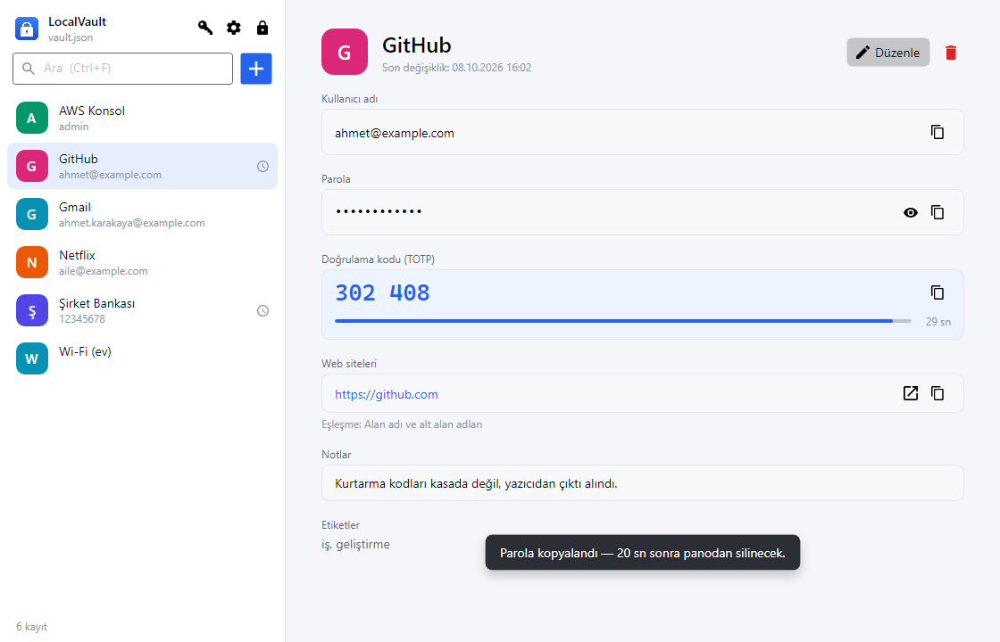

# LocalVault

KeePassXC / 1Password benzeri, tamamen yerel çalışan parola yöneticisi. Kullanıcı adı, parola ve
TOTP anahtarları **şifreli bir JSON dosyasında** tutulur; tarayıcı eklentisi giriş ve OTP alanlarını
otomatik doldurur.



## Kurulum

1. `LocalVault-0.5.0-win-x64.zip` dosyasını çıkarın ve **`install.cmd`**'ye çift tıklayın.
   Yönetici yetkisi gerekmez; .NET kurulu olması gerekmez (çalışma zamanı pakete dahildir).
2. LocalVault açılır; ilk açılışta ana parolanızı belirleyip kasanızı oluşturun.
3. Tarayıcı eklentisini yükleyin (ayrıntılar aşağıda ve paketteki `KURULUM.txt` dosyasında):
   `chrome://extensions` → Geliştirici modu → Paketlenmemiş öğe yükle →
   `%LOCALAPPDATA%\Programs\LocalVault\extension\chrome`

Kurulum şunları yapar ve kaldırmada hepsini geri alır: dosyaları `%LOCALAPPDATA%\Programs\LocalVault`
altına kopyalar, Başlat menüsü (ve isteğe bağlı masaüstü) kısayolu ile "Uygulamalar ve özellikler"
kaydı oluşturur, native host'u Chrome/Edge/Firefox'a kaydeder. Kasa dosyanıza (`%APPDATA%\LocalVault`)
hiçbir zaman dokunulmaz. Güncelleme için yeni sürümün `install.cmd`'sini çalıştırmanız yeterlidir
(çalışan uygulama kapatılıp dosyalar değiştirilir).

İsteğe bağlı seçenekler: `install.ps1 -AutoStart` (Windows açılışında başlat), `-AddToPath`
(`localvault-cli` komutunu PATH'e ekle), `-InstallDir <klasör>`.

### Paketi oluşturma

```bash
pwsh build/package.ps1            # testler + yayın → artifacts/LocalVault-<sürüm>-win-x64.zip (+ .sha256)
pwsh build/package.ps1 -SkipTests
pwsh build/package.ps1 -Runtime win-arm64
```

Sürüm numarası `Directory.Build.props` dosyasındadır. Uygulama dijital olarak imzalanmadığı için
indirilen paket SmartScreen uyarısı verebilir.

## Mimari

```
[Tarayıcı eklentisi (Chrome / Edge / Firefox)]
        │  Native Messaging (stdin/stdout JSON)
        ▼
[Vault.NativeHost (.NET konsol)]
        │  Named pipe (yalnızca yerel kullanıcı)
        ▼
[Vault.Desktop (Avalonia, tray)] ──► vault.json (Argon2id + AES-256-GCM)
```

## Yol haritası

| Faz | Kapsam | Durum |
|---|---|---|
| 1 | Core (şifreli kasa, TOTP, URL eşleştirme, parola üreteci) + CLI + testler | ✅ |
| 2 | Avalonia masaüstü uygulaması (CRUD, kilit, TOTP görünümü, pano temizleme, tray) | ✅ |
| 3 | Native host + named pipe + eşleştirme + eklentiyle kullanıcı adı/parola doldurma (Chrome, Edge, Firefox) | ✅ |
| 4 | Eklentide OTP alanı algılama, çok adımlı giriş, 6 kutulu OTP formları | ✅ |
| 5 | Auto-Type (masaüstü uygulamalar), yeni hesap kaydetme önerisi, CSV içe aktarma, QR'dan OTP okuma | ✅ |

## Tarayıcı eklentisi

### Kurulum

1. Masaüstü uygulamasını en az bir kez çalıştırın. Uygulama, native host'u (`LocalVault.NativeHost.exe`)
   Chrome, Edge ve Firefox'a otomatik kaydeder (yalnızca geçerli kullanıcı için `HKCU`, yönetici gerekmez).
   Elle kayıt/kaldırma: `LocalVault.NativeHost.exe --register` / `--unregister`.
2. Eklentiyi derleyin:
   ```bash
   cd extension && node build.mjs
   ```
3. Yükleyin:
   - **Chrome / Edge:** `chrome://extensions` (Edge: `edge://extensions`) → *Geliştirici modu* → *Paketlenmemiş öğe yükle* →
     `extension/dist/chrome`. Eklenti kimliği her makinede sabittir: `cfhminffkiclobdbhggbnpapfknickdi`.
   - **Firefox:** `about:debugging#/runtime/this-firefox` → *Geçici eklenti yükle* → `extension/dist/firefox/manifest.json`.
     (İmzasız eklentiler Firefox'ta yalnızca tarayıcı kapanana kadar yüklü kalır; kalıcı kurulum için
     Developer Edition'da `xpinstall.signatures.required=false` veya AMO üzerinden imzalama gerekir.)
4. Eklenti simgesi → *Bağlan*. LocalVault penceresinde açılan istekteki doğrulama kodunun eklentidekiyle
   aynı olduğunu kontrol edip *İzin ver*'e tıklayın.

### Kullanım

- Giriş alanlarının sağındaki **kilit simgesine** tıklayın: siteye tek hesap kayıtlıysa doğrudan doldurur,
  birden fazlaysa seçim menüsü açılır (↑/↓/Enter ile de kullanılabilir).
- **Ctrl+Shift+L**: etkin sekmedeki hesabı doldurur.
- Araç çubuğundaki eklenti simgesi: durum ve bu siteye ait hesaplar.
- İsteğe bağlı *Sayfa açılınca otomatik doldur* ayarı (varsayılan kapalı; ayarlar sayfasında risk açıklaması var).
- Kayıt formlarındaki "yeni parola" alanlarına dokunulmaz.

### Doğrulama kodu (2FA / TOTP)

- Kod alanları otomatik tanınır: `autocomplete="one-time-code"`, "doğrulama kodu", "SMS kodu", "2FA",
  "authenticator" gibi ipuçları; **4–8 ayrı kutulu** formlar ve kutuların arkasındaki **görünmez tek alan**.
  Kupon, posta kodu, captcha, davet kodu gibi "kod" geçen diğer alanlar hariç tutulur.
- Kod alanındaki simgeye (ayrı kutularda son kutunun sağında) tıklayınca kod doldurulur. Ayrı kutulu
  formlarda önce yapıştırma olayı denenir (çoğu bileşen kodu kutulara kendisi dağıtır), olmazsa kutular tek tek doldurulur.
- Kodun süresi dolmak üzereyse (≤2 sn) bir sonraki kod beklenir; site eski kodu reddetmez.
- Açılır pencerede TOTP'li hesapların yanında canlı kod ve geri sayım görünür; koda tıklayınca kopyalanır.
  Sayfa kod adımındaysa "Doldur" düğmesi "Kodu doldur" olur. Ctrl+Shift+L de aynı şekilde davranır.

### Çok adımlı girişler

LocalVault ile bir hesabı doldurduğunuzda, **aynı sekmede 3 dakika içinde** beliren sonraki adımlar aynı
hesapla kendiliğinden tamamlanır:

```
E-posta (simgeye tıklanır) → Parola (kendiliğinden) → Doğrulama kodu (kendiliğinden)
```

- Akış yalnızca sizin başlattığınız bir doldurmayla başlar; masaüstü uygulaması her adımda URL'nin
  kayıtla eşleştiğini yeniden doğrular. Her adım bir kez tamamlanır.
- Eklenti ayarlarındaki *Giriş adımlarını otomatik tamamla* seçeneğiyle kapatılabilir.
- Masaüstü uygulamasının *Ayarlar → Tarayıcı* bölümünden bağlı tarayıcılar görülebilir ve kaldırılabilir.

### Yeni hesap kaydetme

LocalVault'ta olmayan bir hesapla giriş yaptığınızda (veya kayıtlı bir hesabın parolasını değiştirdiğinizde)
sayfanın sağ üstünde **Kaydet / Güncelle / Bu sitede asla** önerisi çıkar.

- Kasada aynı kullanıcı adı ve parola varsa öneri gösterilmez (karşılaştırma masaüstü uygulamasında yapılır;
  eklentiye parola gönderilmez).
- Giriş sonrası sayfa değişse de öneri 2 dakika boyunca gösterilir; parola bu süre yalnızca eklentinin
  arka plan belleğinde tutulur. Çok adımlı girişlerde ilk adımdaki kullanıcı adı hatırlanır.
- Kayıt yalnızca öneri kartındaki gerçek tıklamayla yapılır. Not: sayfa betiği `requestSubmit()` ile de
  "güvenilir" bir gönderim üretebilir; bu yüzden bir site kendi alanlarındaki değerlerle öneri kartını
  açtırabilir — kart kapalı shadow DOM'dadır ve kayıt yine sizin tıklamanıza bağlıdır.
- "Bu sitede asla" listesi eklenti ayarlarından yönetilir.

### Güvenlik modeli

```
Eklenti ──(native messaging, stdin/stdout)──► LocalVault.NativeHost.exe ──(named pipe, CurrentUserOnly)──► Masaüstü uygulaması
```

- **Eşleştirme:** Eklenti 256 bit rastgele bir anahtar üretir; kullanıcı masaüstünde, iki tarafta da görünen
  doğrulama koduyla onaylar. Anahtar kasanın içinde (şifreli) saklanır.
- **İmzalı istekler:** Eşleştirme sonrası her istek HMAC-SHA256 ile imzalanır; zaman damgası ±60 sn ve her nonce
  tek kullanımlıktır (tekrar oynatma koruması). Yanıtlar da imzalıdır.
- **En az bilgi:** Hesap listesi yalnızca başlık ve kullanıcı adı içerir. Parola, kullanıcı bir hesabı
  seçtiğinde ve masaüstü uygulaması URL'nin o kayıtla gerçekten eşleştiğini **yeniden doğruladıktan** sonra verilir.
- **URL'ye eklenti değil tarayıcı karar verir:** Arka plan betiği, sayfanın beyan ettiği değil tarayıcının
  bildirdiği (`sender.url`) adresi kullanır; doldurma anında sayfa başka bir origin'e geçtiyse doldurulmaz.
- **Sayfa içi arayüz:** Simge ve menü kapalı shadow DOM'dadır; yalnızca gerçek kullanıcı tıklamalarına
  (`isTrusted`) tepki verir.
- Kasa kilitliyken tarayıcı hiçbir şey alamaz; kullanıcı bir işlem başlattıysa uygulama penceresi öne gelir.

## Auto-Type (Windows)

Tarayıcı dışındaki uygulamalar (Uzak Masaüstü, VPN istemcisi, PuTTY, kurumsal uygulamalar) için:
**Ctrl+Alt+A** önde olan pencerenin başlığına göre kaydı bulur ve kullanıcı adı/parolayı klavye girdisi olarak yazar.

- Kayıt düzenleyicide *Auto-Type* bölümüne pencere başlığı desenleri yazılır (her satıra bir desen;
  `*` ve `?` joker; jokersiz desen başlığın içinde geçiyorsa eşleşir), ör. `*Uzak Masaüstü*`.
- Eşleşme yoksa veya birden fazlaysa LocalVault bir seçim penceresi açar; "Bu pencereyi kayda ekle"
  işaretlenirse bir dahaki sefere sormadan yazar.
- Tuş dizisi (varsayılan `{USERNAME}{TAB}{PASSWORD}{ENTER}`):

  | Komut | Anlamı |
  |---|---|
  | `{USERNAME}` `{PASSWORD}` `{TOTP}` `{TITLE}` `{URL}` | Kayıttaki değerler (TOTP anlık kod) |
  | `{TAB}` `{ENTER}` `{SPACE}` `{BACKSPACE}` `{ESC}` `{DELETE}` `{UP}` `{DOWN}` `{LEFT}` `{RIGHT}` `{HOME}` `{END}` `{F1}`…`{F12}` | Tuşlar |
  | `{TAB 3}` | Tekrar |
  | `{DELAY 500}` | Bekleme (ms) |
  | `{{}` `{}}` | Süslü parantez |

- Metin Unicode olarak gönderilir (klavye düzeninden bağımsız; Türkçe karakterler doğru yazılır).
- Kısayol tuşları bırakılana kadar beklenir; yazma sırasında odak başka pencereye geçerse işlem durur.
- Yönetici olarak çalışan pencerelere, LocalVault yönetici olarak çalışmıyorsa Windows yazmaya izin vermez.
- Ayarlar → Auto-Type'tan kapatılabilir; kısayol başka bir uygulamada kullanılıyorsa ayarlarda belirtilir.

## İçe aktarma

### CSV (KeePassXC, Bitwarden, 1Password)

Masaüstü: ⚙ menüsü → *CSV'den içe aktar…* — biçim otomatik tanınır, önizleme gösterilir, kasada zaten
bulunan kayıtlar (aynı başlık + kullanıcı adı + site) atlanır. CLI:

```bash
localvault-cli import-csv export.csv [--format auto|keepassxc|bitwarden|1password|generic] [--yes]
```

- KeePassXC grupları ve Bitwarden klasörleri etiket olur; TOTP sütunları (`otpauth://` veya Base32) aktarılır.
- Bitwarden'daki kart/kimlik/not kayıtları atlanır; Steam TOTP desteklenmez (uyarı verilir).
- **CSV dosyası tüm parolaları şifresiz içerir; içe aktardıktan sonra silin.**

### QR kodundan TOTP

- Kayıt düzenleyicide *QR tara*: ekrandaki QR kodu (LocalVault kısa süre küçülür), panodaki görüntü
  (Win+Shift+S ile alınmış ekran alıntısı) veya görüntü dosyası.
- ⚙ menüsü → *QR kodundan hesap ekle*: aynı kaynaklardan yeni kayıt(lar) oluşturur.
- **Google Authenticator'ın "Hesapları aktar" QR kodu** (`otpauth-migration://`) da desteklenir; içindeki
  tüm hesaplar tek seferde içe aktarılır.

## Kasa dosyası biçimi

```json
{
  "format": "localvault",
  "version": 1,
  "kdf": { "algorithm": "argon2id", "salt": "...", "memoryKb": 65536, "iterations": 3, "parallelism": 4 },
  "cipher": "aes-256-gcm",
  "nonce": "...",
  "tag": "...",
  "data": "<şifreli içerik>"
}
```

- Anahtar, ana paroladan Argon2id ile türetilir (64 MB, 3 tur).
- `data` alanı AES-256-GCM ile şifrelenir. Başlık alanları (KDF parametreleri vb.) ek doğrulanmış
  veri (AAD) olarak bağlanır; dosyada herhangi bir değişiklik şifre çözmeyi başarısız kılar.
- Kayıt atomiktir (önce `.tmp`, sonra yer değiştirme) ve önceki sürüm `vault.json.bak` olarak saklanır.
- Kasa açıkken dosya başka bir uygulama tarafından değiştirilirse kaydetme reddedilir.

Varsayılan konum: `%APPDATA%\LocalVault\vault.json` (`LOCALVAULT_PATH` ortam değişkeniyle değiştirilebilir).

## URL eşleştirme

Her kaydın bir eşleşme modu vardır: `domain` (varsayılan), `host`, `startswith`, `exact`, `never`.
`domain` modunda yalnızca kayıtlı host ve onun alt alan adları eşleşir:

| Kayıt | Sayfa | Sonuç |
|---|---|---|
| `github.com` | `gist.github.com` | ✅ |
| `github.com` | `github.com.evil.com` | ❌ |
| `github.com` | `evil-github.com` | ❌ |
| `https://example.com` | `http://example.com` | ❌ (HTTPS → HTTP düşürme yok) |
| `localhost:3000` | `localhost:4000` | ❌ |

## Masaüstü uygulaması

```bash
dotnet run --project src/Vault.Desktop
```

- İlk açılışta kasa oluşturma ekranı gelir; sonraki açılışlarda kilit ekranı.
- Kayıt ekleme/düzenleme, arama, canlı TOTP kodu (geri sayım çubuğuyla), parola üreteci.
- 2FA kurulumunda sitenin verdiği gizli anahtar ya da QR kodun içeriği (`otpauth://…`) yapıştırılır;
  başlık, kullanıcı adı, hane/süre/algoritma otomatik dolar.
- Kopyalanan parola ve OTP kodu **Windows pano geçmişine (Win+V) ve bulut panosuna girmez** ve
  ayarlanan süre sonunda (varsayılan 20 sn) panodan silinir — kullanıcı bu arada başka bir şey
  kopyaladıysa ona dokunulmaz.
- Otomatik kilit: bilgisayar boşta kalınca (varsayılan 5 dk), Windows oturumu kilitlenince ve uyku
  moduna geçerken. Kilitlenince türetilmiş anahtar bellekten silinir.
- Kapat düğmesi uygulamayı sistem tepsisine gizler; çıkış tepsi menüsünden yapılır. Uygulama
  kullanıcı başına tek örnek çalışır (ikinci kez açılırsa mevcut pencere öne gelir).
- Kasa CLI gibi başka bir uygulama tarafından değiştirilirse üzerine yazılmaz; diskteki sürümü
  yükleme önerilir.

| Kısayol | İşlev |
|---|---|
| Ctrl+N | Yeni kayıt |
| Ctrl+E | Seçili kaydı düzenle |
| Ctrl+S | Düzenleyicide kaydet |
| Ctrl+B / Ctrl+C / Ctrl+T | Kullanıcı adı / parola / doğrulama kodunu kopyala |
| Ctrl+F | Ara |
| Ctrl+G | Parola üreteci |
| Ctrl+L | Kilitle |
| Delete | Seçili kaydı sil (onaylı) |
| Esc | Katmanı / düzenleyiciyi kapat, aramayı temizle |

Ayarlar `%APPDATA%\LocalVault\settings.json` dosyasında tutulur (gizli bilgi içermez).

## Derleme ve test

```bash
dotnet build
dotnet test
```

`Vault.Desktop.Tests` arayüzü Avalonia headless ile test eder: akışlar (oluşturma, kilit/açma,
ekleme/düzenleme/silme, dış değişiklik çakışması, ana parola değiştirme), XAML bağlama hataları ve
her ekranın açık/koyu temada PNG görüntüsü (`LOCALVAULT_SCREENSHOTS` klasörüne).

Eklenti testleri (bağımlılık yok):

```bash
cd extension
node --test "test/*.test.mjs"   # protokol (C# ile ortak test vektörleri) ve alan sınıflandırma
node test/serve.mjs 8765        # tarayıcıda elle denemek için test sayfaları: /test/fixtures/index.html
                                # (OTP: tek alan, 6 kutu, yalnızca yapıştırma, görünmez alan, çok adımlı akış)
```

Gerçek tarayıcıyla uçtan uca test (geçici profil, headless; eklenti → native host → pipe → test sunucusu).
Eşleştirme, doldurma, 2FA akışı, 6 kutulu OTP, farklı origin koruması ve yeni hesap kaydetme önerisini sınar:

```bash
dotnet build tests/Vault.Bridge.TestServer
cd extension && node build.mjs && node test/serve.mjs 8765   # ayrı terminalde
node test/e2e/run.mjs "C:/Program Files (x86)/Microsoft/Edge/Application/msedge.exe" ../tests/Vault.Bridge.TestServer/bin/Debug/net10.0/Vault.Bridge.TestServer.dll
```

> Not: Google Chrome 137+ komut satırından (`--load-extension`) eklenti yüklemeyi kapattığı için
> otomatik test Edge ile çalışır; Chrome'da eklenti elle yüklenerek kullanılır.

Gerçek Windows panosunu kullanan testler panoyu değiştirdiği için yalnızca açıkça çalıştırılır:

```bash
tests/Vault.Desktop.Tests/bin/Debug/net10.0/Vault.Desktop.Tests.exe -class Vault.Desktop.Tests.WindowsClipboardTests -explicit only
```

## CLI

Kurulu pakette `localvault-cli.exe` olarak bulunur (geliştirirken: `dotnet run --project src/Vault.Cli -- help`).

Örnekler:

```bash
localvault-cli init
localvault-cli add --title GitHub --url https://github.com --username ahmet --generate --totp "otpauth://totp/GitHub:ahmet?secret=..."
localvault-cli list
localvault-cli totp github --watch
localvault-cli match https://gist.github.com/
localvault-cli show github --reveal
localvault-cli export yedek.json      # ŞİFRESİZ — yalnızca yedek/taşıma için
```

## Güvenlik notları

- OTP anahtarı parolayla aynı kasada durduğundan, kasası ele geçirilen biri iki faktöre birden
  sahip olur (1Password / KeePassXC'de de böyledir). Ana parolayı güçlü tutun.
- .NET'te `string` içindeki parolalar bellekten tamamen silinemez. Türetilmiş anahtar ve ara
  tamponlar ise kullanımdan sonra sıfırlanır.
- `export` çıktısı şifresizdir; işiniz bitince dosyayı silin.
